<!-- _class: blue title -->


<div class="title-layout">
<div class="title-left">
<h1>No Message Left Behind</h1>
<h3>What if your messages are delivered reliably without any fancy, complex tools and maintenance effort?</h3>
</div>
<div class="title-right">
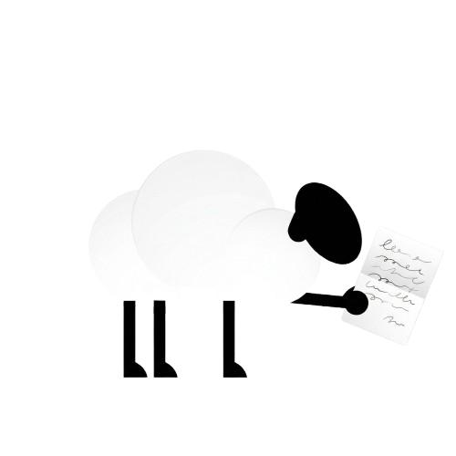
</div>
</div>

---

<!-- _class: video-full -->

<video controls autoplay>
    <source src="assets/paperboy.mp4" type="video/mp4">
    Your browser does not support the video tag.
</video>

<!--
With reliable messaging I had to think back of a game I played in the 90s. Do you know which one it is? It's Paperboy from 1985.
-->

---

<div class="about-layout">
<div class="about-text">
<h2>Stefan Tomm</h2>
<ul>
<li>Professional Software Engineer by heart since 2008</li>
<li>at meshcloud since 2017 building a Sovereign Internal Developer Platform</li>
<li>Actively developing and improving our product every day with the team</li>
<li>Currently fascinated by how to improve our Dev process with AI efficiently</li>
</ul>
</div>
<div class="about-photo">

</div>
</div>

---

## Why this talk?

- We needed a **simple but reliable** messaging solution at meshcloud
- Pieces existed in blog posts — wiring them together end-to-end took quite some effort
- A **complete, working example** — not just theory and the happy path

<!--
The pieces existed scattered across blog posts, but no single complete example showed how to wire everything together end-to-end in Spring Boot.
-->

---

## Setting the Scene

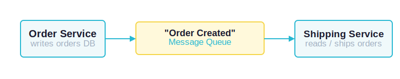

> **But what can go wrong?** *Spoiler: quite a lot.*

<!--
Classic e-commerce flow: two services, one message queue. An order comes in, we publish a message, shipping picks it up. Sounds simple — but there are several failure scenarios to address.
-->

---

## The Happy Path

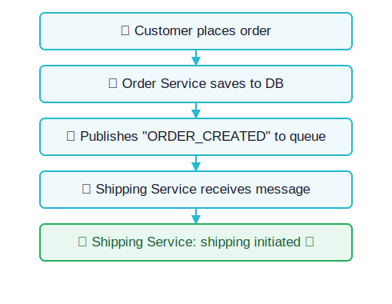

<!--
This works perfectly — as long as nothing ever fails. But we're building distributed systems. Things will fail. Let's walk through the failure scenarios one by one.
-->

---

<!-- _class: blue -->

## Failure on Producer Side

### DB and broker fall out of sync

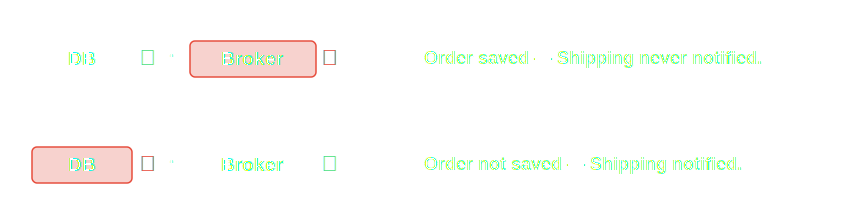

<!--
Two systems, one operation — either the message is lost or the order isn't saved. Both leave the system in an inconsistent state.
-->

---

## The Naive Approach

Publish the event **inside** the open DB transaction.

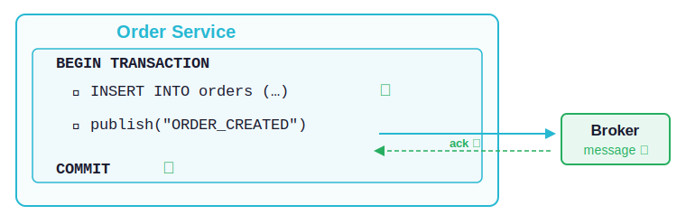

> Looks safe — message is only published after the order is already saved. What could go wrong?

<!--
The order is saved first, then the message is published — all within the same open transaction. Looks like a perfectly safe ordering. But there's a subtle trap hiding here.
-->

---

## The Transaction Can Still Fail

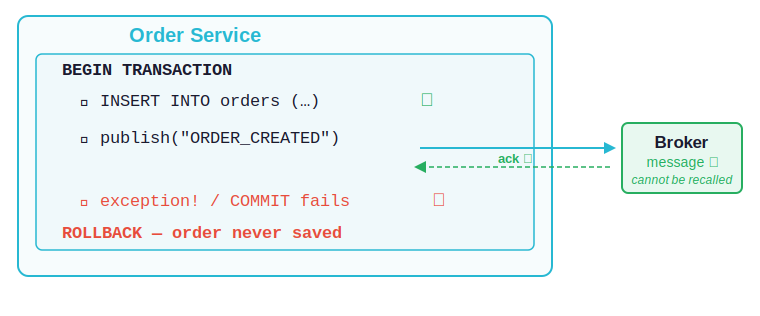

> Order not saved, but Shipping will **process** the **event anyway**

<!--
The publish succeeds and the broker acks the message. At this point the message is already in flight and will eventually be processed by the Shipping Service. Then any code running after the publish can throw an exception, or the transaction commit itself can fail. The order disappears via rollback, but shipping is already notified. Unlike "broker is down", this failure is subtle: everything looked fine during the publish step.
-->

---

## Publish After the Transaction?

Move the publish **outside** the transaction to eliminate the rollback risk.

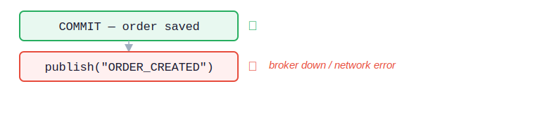

> Order saved in DB, but shipping **never notified**
> **Same silent data loss** — just a different failure window

<!--
The obvious alternative: commit first, then publish. This removes the rollback risk. But now there's a new failure window: if the publish fails after a successful commit, the order exists in the database but the shipping service never receives the event. There is no safe ordering when you have two different systems to update atomically.
-->

---

## What About Two-Phase Commit (2PC)?

Coordinate DB and broker atomically via a distributed transaction protocol.

| | |
|---|---|
| **Complexity** | Requires an XA transaction manager across two systems |
| **Performance** | Blocking protocol — degrades throughput significantly |
| **RabbitMQ** | No XA / 2PC support out of the box |

> Too much complexity, too little payoff — **there is a simpler way.**

<!--
2PC sounds like the "correct" solution for atomic cross-system writes. In practice it requires XA-capable drivers, a transaction coordinator, and both systems to support the protocol. RabbitMQ simply doesn't offer this. Even where 2PC is technically available it's rarely worth the operational burden.
-->

---

## Solution: The Transactional Outbox

<div class="success-box">Write the event to an <strong>outbox table in the same DB transaction</strong></div>

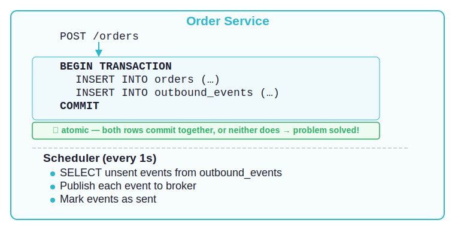

<!--
Core idea: Don't publish to the broker directly. Instead, write the event to an outbox table in the same database, in the same transaction. Either both rows commit, or neither does — the event can never be lost.
The publish is fully decoupled from the business operation. If the broker is down, events simply queue up in the database and get published once it's back.
-->

---

## Outbox: What about concurrency?

**`SELECT … FOR UPDATE SKIP LOCKED`** ensures:

- Each instance locks only the rows it claims
- Other instances **skip** locked rows — no waiting, no double-publishing

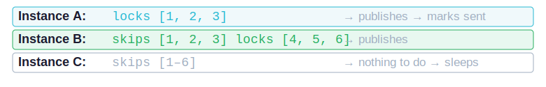

Scales horizontally with **zero coordination overhead**.

<!--
Multiple instances of the service can poll the outbox concurrently. SKIP LOCKED ensures no double-publishing, no blocking, no deadlocks.
-->

---

## Outbox: What about failures?

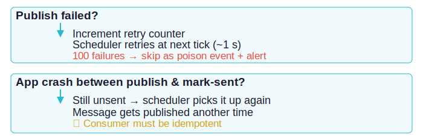

> The outbox makes events **durable** — survives crashes, restarts, and broker outages.

<!--
Key insight: The outbox makes the event durable in your database. It survives app crashes, deployment restarts, and broker outages. If the app crashes between publish and mark-as-sent, the event will be re-published — the consumer must handle the resulting duplicate.
-->

---

## ✅ Producer Problem — Solved

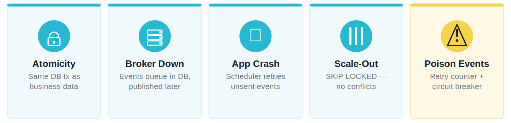

<!--
Rule of thumb: Never publish to a broker outside of a transaction. Save the event where you save the data.
-->

---

<!-- _class: blue -->

## Failure on Consumer Side

### The consumer can't process the message

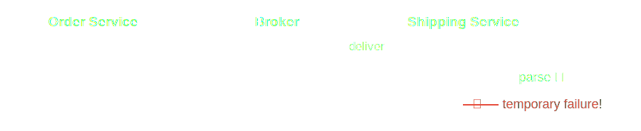

<!--
The message was delivered, but the consumer failed to process it. Maybe a downstream API is down. Maybe the database is overloaded. Maybe it's a transient network blip.
-->

---

## Naive Thought

"RabbitMq will handle it for us automatically."

No, it can either **requeue** directly or write to a **Dead Letter Exchange**.

<!--
Unlike the producer problem, the message was received. The consumer just couldn't finish the work — this time.
-->

---

## Naive fix: Requeue immediately

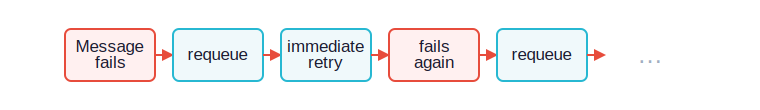

**Problems:**
- Burns CPU & network for nothing
- Potentially overwhelms an already struggling dependency
- Pollutes logs with thousands of identical errors

> We need to **back off** between retries.

<!--
This creates a hot retry loop. It doesn't give the downstream system time to recover.
-->

---

## What we really want: Exponential backoff

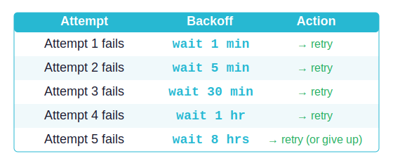

> **RabbitMQ has no native delayed delivery.**
> → Build it from standard features.

<!--
This stops the hot loop and gives dependencies room to recover. But RabbitMQ doesn't support delayed delivery natively — so we need to build delays ourselves using DLX + TTL.
-->

---

## Dead-Letter Exchange (DLX) & Dead Letter Queue (DLQ)

A DLX can be defined on a queue for rejected & expired messages.

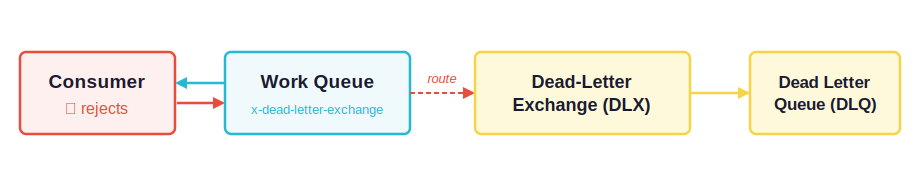

<!--
DLX is a standard RabbitMQ feature configured on any queue via the x-dead-letter-exchange argument. When the consumer nacks/rejects a message, RabbitMQ automatically routes it to that exchange. The DLX then routes the message into a Dead Letter Queue. Crucially, there is no consumer on the DLQ — the message just parks there. This is the first primitive we'll use to build our delay mechanism.
-->

---

## Message TTL

A queue can be configured with a **TTL** (time-to-live) for its messages.

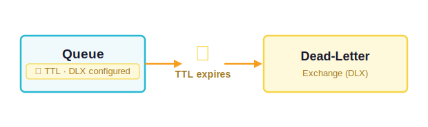

> **TTL + DLX = delay line** - Standard RabbitMQ, no plugins needed.

<!--
The second primitive. A wait queue configured with TTL and a DLX acts as a delay line. The message enters, waits for exactly the TTL duration, and is then automatically forwarded via the DLX. Combining these two standard RabbitMQ features gives us configurable delayed delivery without any plugins or special infrastructure.
-->

---

## Solution: The Retry Ladder

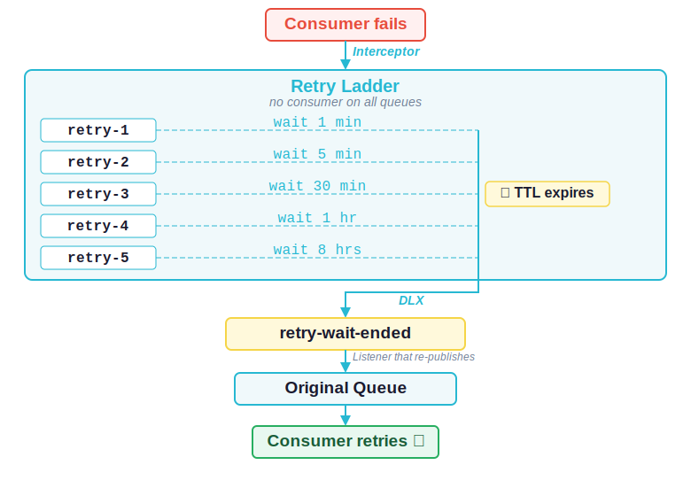

<!--
Attempt 1: Consumer receives message → fails. Route to retry-1. Message sits for 1 minute.
Attempt 2: Message returns via DLX → consumer retries → fails again. Route to retry-2. Message sits for 5 minutes. And so on.
After all retries exhausted: Message stays in the last retry queue, acting as a soft dead-letter queue where operators can inspect and intervene.
The system gives the failing dependency time to recover — most transient issues resolve within the first few retries.
-->

---

## Why separate queues per TTL level?

> **TTL expiry is only checked at the head of the queue (FIFO).**

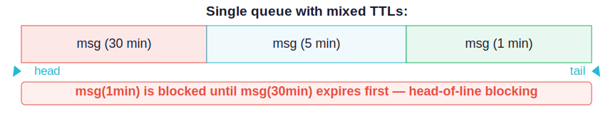

**→ One dedicated queue per TTL level.**

<!--
A critical RabbitMQ detail most people don't know: if you mix different TTLs in one queue, shorter delays get stuck behind longer ones. The solution: one dedicated queue per TTL level, so every message expires on time.
-->

---

## How is the routing to retry queues done?

An **interceptor** wraps around the original message listener:

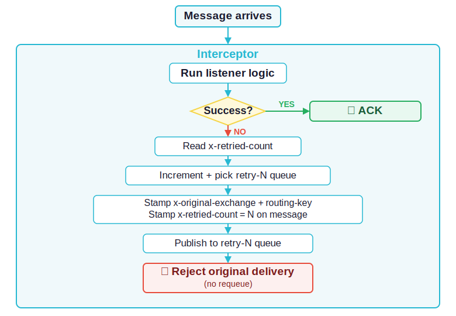

<!--
This is AOP — a cross-cutting concern wired in as middleware, not scattered through your business logic. The interceptor handles all retry routing transparently.
-->

---

## A note on acknowledgment

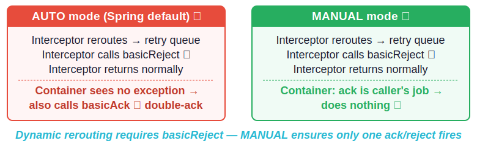

<!--
Spring AMQP AUTO mode is the default — and it looks like it should work. But it doesn't for our retry rerouting pattern.

Here's why: the RetryQueueInterceptor catches the exception, re-publishes the message to the retry queue, calls channel.basicReject(deliveryTag, false), and then returns normally (no exception propagates to the container). Spring's container, running in AUTO mode, sees a normal return from the advice chain and automatically calls basicAck on the same delivery tag. RabbitMQ receives two acknowledgement attempts for the same delivery → PRECONDITION_FAILED "unknown delivery tag" → the channel is closed.

With MANUAL mode, the container does not touch ack/nack at all — it is entirely the interceptor's responsibility. The interceptor calls basicAck on success and basicReject on failure, exactly once, with no container interference.
-->

---

## Reminder: The Retry Ladder


---

## The `retry-wait-ended` queue

It simply routes back to the original queue (see `RetryWaitEndedRabbitListener`)

```kotlin
@RabbitListener(queues = ["retry-wait-ended"])
fun onMessage(message: Message) {
    val exchange   = headers["x-original-exchange"]    as String
    val routingKey = headers["x-original-routing-key"] as String

    rabbitTemplate.send(exchange, routingKey, message) // back to original queue
}
```
<br>

<!--
The retry-wait-ended queue is a single funnel. All five retry queues drain into it when their TTL fires. The RetryQueueInterceptor writes x-original-exchange and x-original-routing-key headers when it handles the very first failure. Those headers travel with the message through every hop of the retry ladder. When the message finally reaches retry-wait-ended, the RetryWaitEndedRabbitListener reads those two headers and re-publishes to the original destination. The x-retried-count header is also preserved, so when the consumer attempts processing again the interceptor knows how many retries have already happened.
-->

---

## Optional: Two layers of retry

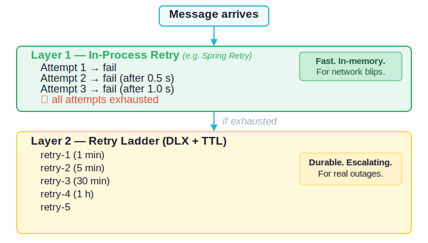

**See `ShippingRabbitConfig` in code**

---

## ✅ Consumer Problem — Solved

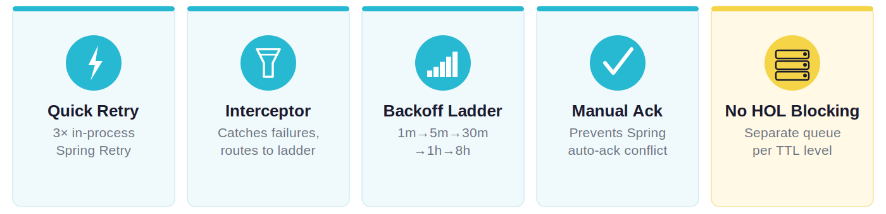

<!--
The system heals itself. Most issues resolve within the first few retries. Operators only get involved for the rare persistent failure.
-->

---

## The Complete Picture

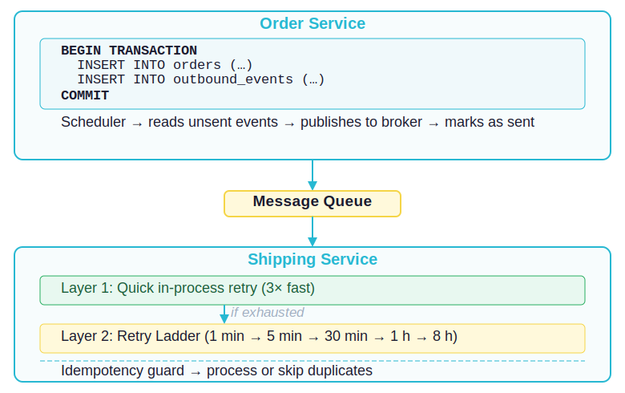

---

## Production Reality

### 🙂 It's boring (in the best way)
No special infrastructure · Standard RabbitMQ only · Minimal maintenance

### 📊 What to monitor
- **Outbox table** growing? → broker issue
- **retry-3/4/5** filling up? → real outage
- **retry-5 depth** > 0? → human intervention needed

### ⚠️ What it's not
- Not exactly-once
- Not zero-latency *(outbox ~1s; retries add minutes)*

<!--
We run this exact setup in production. Minimal maintenance, no special infrastructure, standard RabbitMQ features only — no plugins, no Debezium, no CDC.
-->

---

<!-- _class: blue -->

## Demo Time! 🚀

Let's see it in action


---

<!-- _class: blue -->


<div class="thankyou-layout">
<div class="thankyou-text">

# Thank You!

Full source code & presentation on GitHub:

**[https://github.com/meshcloud/resilient-rabbitmq-demo](https://github.com/meshcloud/resilient-rabbitmq-demo)**

</div>
<div class="thankyou-qr">

GitHub Repo
</div>
</div>

<br>

### Further reading

- RabbitMQ Dead-Letter Exchanges — [rabbitmq.com/docs/dlx](https://www.rabbitmq.com/docs/dlx)
- Transactional Outbox Pattern — [microservices.io/patterns/data/transactional-outbox](https://microservices.io/patterns/data/transactional-outbox.html)
